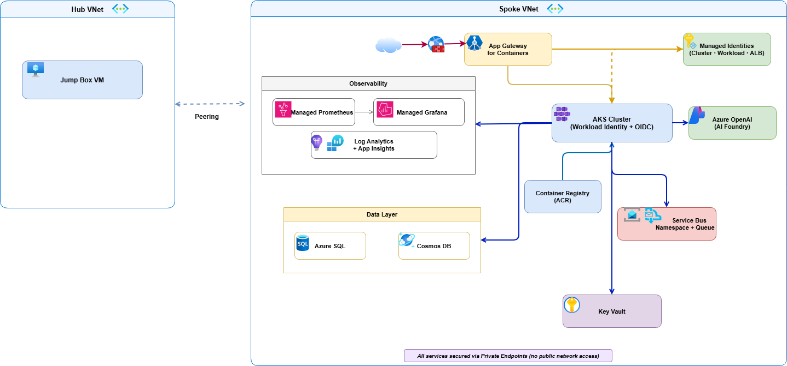
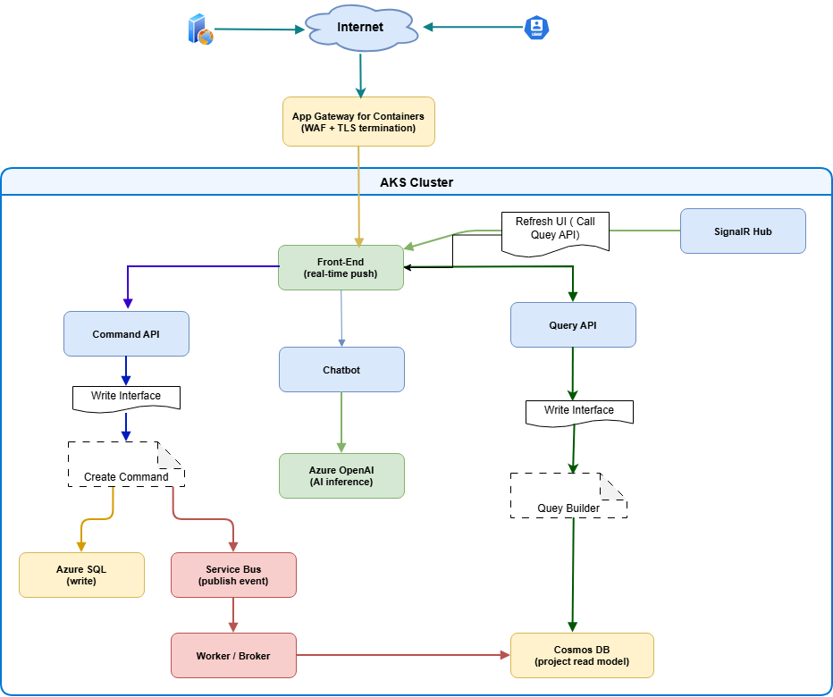

# Building LogCorner.EduSync.Speech: Event-Driven Microservices on AKS

LogCorner.EduSync.Speech is a cloud-native, event-driven microservices platform built with .NET and deployed to Azure Kubernetes Service (AKS). The solution applies CQRS and event-driven projection patterns to separate write workloads from read workloads, while adding real-time updates and AI-powered conversational capabilities.

## Why this architecture

The platform is designed to support scalable write/read separation, asynchronous processing, and secure cloud-native operations.

- **Command side** handles transactional writes in Azure SQL.
- **Messaging layer** uses Azure Service Bus for decoupled event transport.
- **Projection side** materializes read models into Cosmos DB.
- **Query side** serves optimized read APIs from Cosmos DB.
- **SignalR Hub** pushes near-real-time notifications to clients.
- **Chatbot service** integrates Azure OpenAI for AI interactions.

## High-level system overview



At runtime, the front-end sends create/update/delete actions to the Command API. After successful persistence to Azure SQL, events are published to Azure Service Bus. A broker/worker service consumes those events and updates read projections in Cosmos DB. Query APIs then serve these projections, while SignalR pushes updates to connected clients. The chatbot service handles conversational requests by calling Azure OpenAI.

## Azure infrastructure topology

The platform is deployed with a private, identity-first Azure topology:

- **Network isolation** with hub-and-spoke VNets, peering, and Private DNS zones.
- **Private endpoints** for core PaaS resources.
- **AKS cluster** using OIDC + Workload Identity.
- **Application Gateway for Containers** for ingress, WAF, and TLS termination.
- **Azure Container Registry (ACR)** for container images.
- **Key Vault** for secrets and certificate material.
- **Azure SQL, Cosmos DB, and Service Bus** for data and asynchronous integration.
- **Azure Monitor stack** with Application Insights, Log Analytics, Managed Prometheus, and Managed Grafana.

## Source code structure

The `src/` folder is organized by runtime concerns and bounded contexts:

| Context | Responsibility | Main Location |
|---|---|---|
| Command | Write API, transactional persistence, event publishing | `src/Command/` |
| Broker | Event consumption and read model projection | `src/broker/` |
| Query | Read APIs over projected data | `src/Query/` |
| Hub | Real-time notifications via SignalR | `src/Hub/` |
| Front | User-facing web app orchestration | `src/Front/` |
| Chatbot | AI-assisted conversational API | `src/Chatbot/` |

### Key implementation details

- Command startup wires SQL Server DbContext, event infrastructure, and Service Bus producer integration.
- Broker worker startup wires hosted services, Service Bus consumer, Cosmos dependencies, and SignalR client integration.
- Query startup uses `DefaultAzureCredential` to connect to Cosmos DB, supporting managed identity via `AZURE_CLIENT_ID` and `AZURE_TENANT_ID`.

## End-to-end data flow



1. Internet traffic enters through Application Gateway for Containers (WAF + TLS).
2. Requests are routed to workloads in AKS.
3. Command API writes state to Azure SQL.
4. Command workflows publish events to Azure Service Bus.
5. Broker/Worker consumes events and updates Cosmos DB projections.
6. Query API serves reads from Cosmos DB.
7. SignalR Hub pushes updates to connected front-end clients.
8. Chatbot service calls Azure OpenAI for AI inference.

## Deployment workflow

The platform is provisioned and released using Bicep, PowerShell, Docker, and Helm.

### Prerequisites

- Azure CLI (with `alb` extension)
- Azure PowerShell (`Az` module)
- `kubectl`
- `helm`
- Docker
- Azure subscription with Contributor + User Access Administrator role

### 1) Deploy infrastructure with Bicep

```powershell
$resourceGroupName = "RG-EVENT-DRIVEN-ARCHITECTURE"

New-AzResourceGroupDeployment `
	-Name "datasynchro-event-driven-architecture" `
	-ResourceGroupName $resourceGroupName `
	-TemplateFile iac/bicep/main.bicep `
	-TemplateParameterFile iac/bicep/main.bicepparam `
	-DeploymentDebugLogLevel All
```

### 2) Build and push service images

```powershell
.\build_and_deploy_images.ps1 -acrName "datasynchroacr"
```

### 3) Upload TLS certificate to Key Vault

```powershell
$pfxPassword = Read-Host "Enter PFX password" -AsSecureString

.\create_and_upload_certificate.ps1 `
	-vaultName        "kv-datasynchro-005" `
	-certificateName  "logcorner-datasync-cert" `
	-domain           "cloud-devops-craft.com" `
	-pfxPassword      $pfxPassword
```

### 4) Deploy workloads with Helm

```powershell
Set-Location "helm-chart\chart"

.\deploy_helm_chart.ps1 `
	-RESOURCE_GROUP                      "RG-EVENT-DRIVEN-ARCHITECTURE" `
	-WORKLOAD_NAMESPACE                  "azure-workloads" `
	-RELEASE_NAME                        "logcorner-command" `
	-ALB_IDENTITY_NAME                   "azure_alb_identity" `
	-GATEWAY_CONTROLLER_NAMESPACE        "azure-alb-system" `
	-APPLICATION_FOR_CONTAINER_HOST_NAME "app.cloud-devops-craft.com" `
	-UAMI                                "workload-managed-identity" `
	-CLUSTER_NAME                        "datasynchro-aks" `
	-CERTIFICATE_NAME                    "logcorner-datasync-cert" `
	-APP_GATEWAY_FOR_CONTAINER_NAME      "appgwforcon-datasynchro" `
	-WAF_POLICY_NAME                     "appgwc-waf-policy" `
	-APP_INSIGHTS_NAME                   "datasyncappi"
```

## Kubernetes and Helm operations

```powershell
# List pods and services
kubectl get pods -n azure-workloads
kubectl get svc  -n azure-workloads

# Restart all deployments
kubectl rollout restart deployment -n azure-workloads

# View pod logs
kubectl logs <pod-name> -n azure-workloads
```

```powershell
# Helm lifecycle quick reference
helm install logcorner-command logcorner.edusync.speech
helm list --short
helm get manifest logcorner-command
helm upgrade logcorner-command logcorner.edusync.speech
helm rollback logcorner-command 1
helm history logcorner-command
helm uninstall logcorner-command
```

## Security and identity model

Security is built into the platform architecture:

- Private endpoint-first design for core services.
- Managed identity and workload identity for passwordless access.
- Centralized secrets and certificate handling in Azure Key Vault.
- WAF-protected ingress via Application Gateway for Containers.
- VNet segmentation and private DNS for controlled east-west and north-south traffic.

## Observability model

Operational visibility combines application and platform telemetry:

- Application Insights and Log Analytics for traces, logs, and diagnostics.
- Managed Prometheus + Managed Grafana for metrics and dashboards.
- Azure Monitor action groups for alert routing.

## CI/CD

Azure Pipelines definitions are available in:

- `cicd/azure-pipelines-build.yml` for build/test workflows
- `cicd/azure-pipelines-db.yml` for database workflows
- `cicd/azure-pipelines-helm.yml` for Helm deployments

## Architectural takeaways

LogCorner.EduSync.Speech demonstrates a practical reference for running event-driven microservices on AKS with CQRS separation, secure private networking, identity-first access, and integrated observability. The result is a platform that supports independent scaling of write/read paths, real-time user feedback, and AI-enabled experiences while staying aligned with modern Azure cloud-native practices.

## References

- [Repository README](../README.md)
- [Architecture details](../ARCHITECTURE.MD)
- [Azure AKS Workload Identity](https://learn.microsoft.com/en-us/azure/aks/workload-identity-deploy-cluster)
- [Application Gateway for Containers](https://learn.microsoft.com/en-us/samples/azure-samples/aks-application-gateway-for-containers-bicep/aks-application-gateway-for-containers-bicep/)
- [Cosmos DB RBAC with managed identity](https://learn.microsoft.com/en-us/azure/cosmos-db/nosql/how-to-connect-role-based-access-control)
- [Helm documentation](https://helm.sh/docs/)
